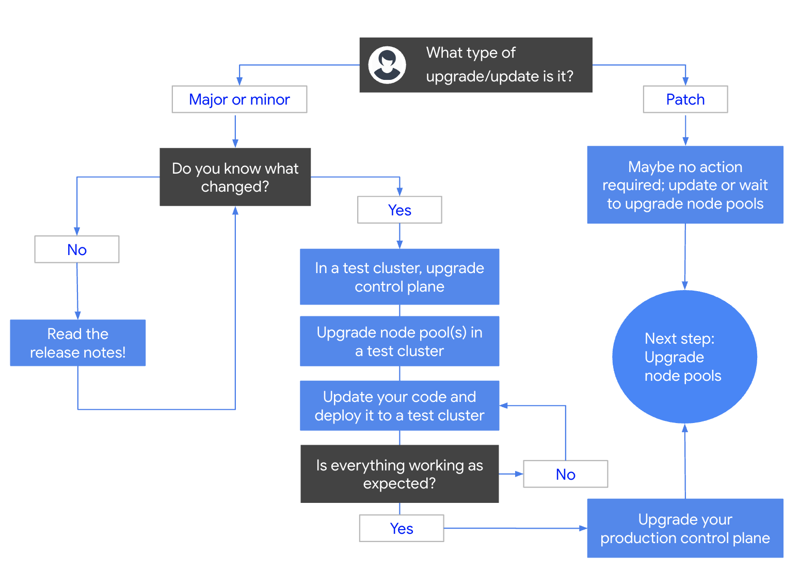

# Kubernetes Engine Rolling Upgrades

Kubernetes Engine is a managed service that provides fully automated
upgrades to keep clusters up to date with the latest Kubernetes versions and
features.  This managed service includes the control plane - API Server,
Workload Controllers, and etcd storage back-end - at no cost to the user.

Worker nodes are organized in "Node Pools" which can take automated or manual
version upgrades.  When you choose manual upgrades of Node Pools, you
have several choices for upgrade methodologies.  This repository illustrates
three different upgrade strategies, discusses their trade-offs, and provides
demos of each.

## Table of Contents

<!--ts-->
  * [Versions](#versions)
  * [Upgrade Paths](#upgrade-paths)
  * [Automated vs Manual Upgrades](#automated-vs-manual-upgrades)
    * [Automated Upgrades](#automated-upgrades)
    * [Manual Upgrades](#manual-upgrades)
  * [Regional vs Multi-Zone Clusters](#regional-vs-multi-zone-clusters)
  * [Highly Available Application Architecture](#highly-available-application-architecture)
  * [Upgrade Strategies](#upgrade-strategies)
    * [In-Place Rolling Upgrade](#in-place-rolling-upgrade)
      * [<a href="./in-place-rolling-upgrade">In Place Rolling Upgrade</a> Example](#in-place-rolling-upgrade-example)
    * [Expand and Contract Upgrade](#expand-and-contract-upgrade)
      * [<a href="./expand-contract-upgrade">Expand and Contract Upgrade</a> Example](#expand-and-contract-upgrade-example)
    * [Blue/Green Upgrade](#bluegreen-upgrade)
      * [<a href="./blue-green-upgrade">Blue/Green Upgrade</a> Example](#bluegreen-upgrade-example)
  * [Downgrades](#downgrades)
  * [Kubernetes Engine and Change Control](#kubernetes-engine-and-change-control)
  * [Relevant Material](#relevant-material)
<!--te-->

## Versions

A Kubernetes Engine version number represents an immutable collection of
Kubernetes components (api server, workload controllers, kube-proxy, kubelet,
etc), the container runtime, and the host VM operating system.

The version numbers are based on the Open Source Kubernetes [Semantic Versioning](https://semver.org)
format.  A Kubernetes Engine version will take the form of `X.Y.Z-gke.N`, where:
*   `X` - Kubernetes major version
*   `Y` - Kubernetes minor version
*   `Z` - Kubernetes patch version
*   `N` - Kubernetes Engine patch version

The `X.Y.Z` portion corresponds directly with the Open Source Kubernetes
version of the same number and is fully compatible.  The various Kubernetes
Engine patch versions (`N`) can contain bug fixes and security patches for the
Kubernetes components, the container runtime, and/or the VM Host OS.

Not all Kubernetes versions are available in Kubernetes Engine.  Generally,
multiple patch
versions of the 3 most recent minor versions are available.  Within minor
versions, patch versions are turned down and are no longer available for new
clusters or upgrades as newer versions are introduced.  Kubernetes Engine
versions are also removed when bugs and/or security vulnerabilities are
discovered.

With this command, you can find the currently available Kubernetes Engine
versions new clusters and upgrades:

```
gcloud container get-server-config [--region <your-region>] [--zone <your-zone>]
```

## Upgrade Paths

Kubernetes Engine supports upgrading from one minor version to the next and any
patch version within a minor version.  Some example version upgrades:
```
1.8.8-gke.0 -> 1.8.12-gke.1
1.8.8-gke.0 -> 1.9.7-gke.3
1.9.7-gke.3 -> 1.10.4-gke.2
```
Invalid version upgrades:
```
1.8.8-gke.0 -> 1.10.4-gke.0
1.8.12-gke.1 -> 1.10.4-gke.2
```
An error will result if you try to make an invalid upgrade.

## Automated vs Manual Upgrades

##### Automated Upgrades

Kubernetes Engine will automatically upgrade the control plane, you can not opt-
out.  You may opt-in to automatic upgrades for Node Pools as well but this
functionality is disabled by default.  When a Node Pool is configured for
automatic updates, Kubernetes Engine will upgrade the Node Pool each time it
detects a difference between the control plane and Node Pool versions.

The control plane upgrade schedule is posted on the [Kubernetes Engine Release
Notes](https://cloud.google.com/kubernetes-engine/release-notes) page.  You can also designate a weekly maintenance window to gain
predictability around the timing of automated upgrades.  Kubernetes Engine,
however, may still make upgrades outside the maintenance window for unplanned,
emergency upgrades.

Though the patch version upgrades will proceed fairly frequently, upgrades to
minor versions will only occur when a specific minor version is being turned
down, or going out of support.  At that time, the control plane will be
upgraded to the next minor version.

When configured for automatic upgrades, you may still manually initiate an
upgrade at any time, provided:
*   A current upgrade is not already in progress
*   A Node Pool version will not be advanced beyond the control plane version

##### Manual Upgrades

Though the control plane is upgraded automatically, you may still take a manual
approach to keeping it up to date.  Automated control plane upgrades are
announced on the [Kubernetes Engine Release Notes](https://cloud.google.com/kubernetes-engine/release-notes) page.  You
can pre-empt this schedule by manually initiating the upgrade prior to the
scheduled automated upgrade.

As most changes in the Kubernetes API functionality happen between minor
versions, many operators will have less concern about patch version upgrades and
allow them to proceed automatically but make planned and deliberate upgrades to
new minor versions.

For Node Pools, manual upgrades are the default configuration but the pools will
still be upgraded when the specific minor version is turned down and removed
from Kubernetes Engine.

If you choose to adopt a manual approach to node pool upgrades, you must keep
an eye on minor version deprecations published in the [Kubernetes Engine Release
Notes](https://cloud.google.com/kubernetes-engine/release-notes) to ensure that you initiate upgrades before the scheduled upgrade.

## Regional vs Multi-Zone Clusters

Regional cluster has multi-node highly available control plane.  This allows
zero-downtime upgrades for control plane and five 9s of availability.  Three
different zones are selected automatically at cluster creation time and one
control plane node is run in each.  The Node Pools are also spread out among
the three zones.

Multi-zone clusters, also called "zonal clusters", have a single control plane
node located in one zone.  The api server will become unavailable during version
upgrades resulting in Kubernetes API unavailability during that time.  The
Node Pool will default to the same single zone but can be expanded to multiple
zones in the same region.

In both cases, the cost for running the control plane is the same for the end
user - $0.

## Highly Available Application Architecture

Highly Available (HA) applications can continue running during planned and
unplanned interruptions.  Specific knowledge of how your application operates
and performs is necessary to ensure your application will be highly available
while running within Kubernetes Engine.

There are specific Kubernetes features to assist in building HA applications.
They include but are not limited to:
*   Having enough replicas of an application to allow continued functioning when
    one or more instances are lost, restarted, or rescheduled on a different
    node.
*   Using `anti-affinity` annotations to avoid multiple replicas of the same
    application being scheduled on the same node.
*   Using `PodDisruptionBudgets` to make sure the appropriate number of
    application replicas are left running when pods are being rescheduled.
*   Using `readinessProbes` to ensure that after rescheduled application
    instances are started they are fully initialized and operational before
    being marked "healthy".

## Upgrade Strategies

There are several strategies available when upgrading Kubernetes Engine
Node Pools.  They range from fast and fully automated, to slow and deliberate.

The types of applications you have running in the cluster should dictate your
choice of upgrade strategy.  The root of this repository has a common properties
file called `env`.  Make a copy and update with values appropriate for your
testing.
```console
cp env .env
```

### In-Place Rolling Upgrade

This is the same procedure used when automated Node Pool upgrades is enabled.
Each node is cordoned, drained, terminated, and finally replaced with a new
node running the new version.  This works well in large clusters that tend
to have significant resource head room.

**[In Place Rolling Upgrade](in-place-rolling-upgrade) Example**

### Expand and Contract Upgrade

The Expand and Contract Upgrade is a further refinement of the Rolling Upgrade.
More capacity is added to the Node Pool prior to the rolling upgrade and then
removed at the end of the upgrade.  This is a good choice for smaller clusters
that don't have significant headroom, or clusters with Stateful workloads using
zone specific disks.

**[Expand and Contract Upgrade](expand-contract-upgrade) Example**

### Blue/Green Upgrade

The Blue/Green, or "Lift and Shift", Upgrade gives the operator the most
control over workload migrations.  A duplicate Node Pool running the new version
is run simultaneously with the Node Pool running the old version.  The nodes
in the old pool are cordoned then the operator can migrate pods to the nodes
running the new version in the order and timing deemed appropriate.

**[Blue/Green Upgrade](blue-green-upgrade) Example**

## Downgrades

**Downgrading the control plane is not possible.**  If you find a unexpected
behaviors during a Node Pool upgrade, you can abort and roll back the Node Pool
to the previous version.

## Kubernetes Engine and Change Control

Change Control procedures generally require making changes during specified
maintenance windows and articulating back-out plans.  Kubernetes Engine can
help organizations achieve these requirements with specific configurations and
planning.

*   Plan and execute Control Plane upgrades prior to the automated upgrade
    schedule
*   Do not configure Node Pools for automatic upgrades and instead plan and
    execute Node Pool upgrades when necessary.
*   Since control plane downgrades are not possible, create/maintain a
    development or staging cluster with identical application workload types to
    test fully upgrades prior to applying them in your production environments.

## Manual upgrade process

Manual upgrades require different considerations and planning depending on
the type of upgrade.  The following decision tree illustrates a high-level
overview of a manual upgrade of a Kubernetes Engine cluster.



## Relevant Material

*   [Kubernetes Engine Release Notes](https://cloud.google.com/kubernetes-engine/release-notes)
*   [Kubernetes Engine Maintenance Window](https://cloud.google.com/kubernetes-engine/docs/how-to/maintenance-window)
*   [Multi-Zone and Regional Clusters](https://cloud.google.com/kubernetes-engine/docs/concepts/multi-zone-and-regional-clusters)
*   [Affinity and Anti-Affinity](https://kubernetes.io/docs/concepts/configuration/assign-pod-node/#affinity-and-anti-affinity)
*   [readinessProbes](https://kubernetes.io/docs/concepts/workloads/pods/pod-lifecycle/#container-probes)


**This is not an officially supported Google product**
