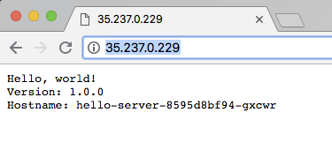

# Kubernetes Engine blue/green Rolling Update

## Table of Contents

<!--ts-->

* [Introduction](#introduction)
* [Architecture](#architecture)
* [Prerequisites](#prerequisites)
   * [Tools](#tools)
   * [Configuration](#configuration)
       * [.env Properties](#env-properties)
       * [Selecting your versions](#selecting-your-versions)
* [Deployment](#deployment)
   * [Manual Deployment](#manual-deployment)
   * [Automated Deployment](#automated-deployment)
* [Validation](#validation)
* [Tear Down](#tear-down)
* [Troubleshooting](#troubleshooting)
* [Relevant Material](#relevant-material)

<!--te-->

## Introduction

This code repository demonstrates a Kubernetes Engine cluster upgrade using the
blue/green, or 'lift and shift', upgrade strategy.  This upgrade strategy is a
great choice for clusters containing mission-critical stateful apps that require
extra care and attention during upgrades and migrations.

Some workloads may have specific concerns that can not be accounted for with
`readinessProbes` and `PodDisruptionBudgets` alone.  In these cases, the
blue/green approach will give you the necessary control to upgrade the cluster
with minimal disruption to the applications running in the cluster.

## Architecture

In a blue/green upgrade, a duplicate node pool of equal size is created with the
new Kubernetes Engine version.  The node pools with old and new Kubernetes
Engine versions are run simultaneously.  This allows individual pods or entire
nodes to be migrated to the new Kubernetes Engine version one at a time as the
operator sees fit.

This example will walk through creating a Kubernetes Engine cluster, deploying
an application, upgrading the Kubernetes Engine Control Plane, creating the new
node pool, migrating the application to the new node pool, and terminating the
old node pool.

To complete this example, you will run `scripts/clutser_ops.sh` contained in
this repository. It uses the `gcloud` and `kubectl` commands to interact with
the Google Cloud Platform and the Kubernetes Engine cluster.

It has been noted by many in the Kubernetes community that running stateful
applications on Kubernetes is not for beginners.  A familiarity with both the
application and Kubernetes are a must to do so successfully.

There are two possibilities when you run a stateful datastore on Kubernetes:

1. You are a very experienced K8s user and know exactly what is around the corner.
2. You have no idea what is around the corner, and you are going to learn very fast.

## Prerequisites

### Tools

Make sure you have installed and access to the following:
1.  [gcloud](https://cloud.google.com/sdk/downloads) (Google Cloud SDK version >= 200.0.0)
1.  [kubectl](https://kubernetes.io/docs/tasks/tools/install-kubectl/) >= 1.10.4
1.  bash or bash compatible shell
1.  [jq](https://stedolan.github.io/jq/)
1.  A Google Cloud Platform project with the containers api enabled.
    ```
    gcloud services list
    gcloud services enable container.googleapis.com
    ```

### Configuration

##### `.env` Properties

A number of environment variables must be set to run the `cluster_ops.sh`
script.  The required variables are provided and explained in the `env` file
found in the root of this repository. Make a copy in the root of this repository:
```
cp env .env
```
Update the `.env` file with appropriate values for your use.  It will be
sourced by the `cluster_ops.sh` script each time it is run.

##### Selecting your versions

In the `.env` file, you must select two Kubernetes versions, `K8S_VER` and
`NEW_K8S_VER`, supply only the open source Kubernetes semver version number and
Kubernetes Engine will select the appropriate Kubernetes Engine patch version
when creating and upgrading the cluster.  This example was tested using the
following versions:
```
K8S_VER=1.9.7
NEW_K8S_VER=1.10.4
```

## Deployment

### Manual Deployment

You can run `cluster_ops.sh` from anywhere in your file system but if you copy
paste these commands exactly, you should first cd into the directory containing
the script. The validation section describes commands to monitor the status of
the cluster and application during the upgrade procedure.

1.  **Create the Kubernetes Engine cluster:**
    The `create` action will create a regional Kubernetes Engine Cluster and
    deploy the example application.
    ```console
    ./cluster_ops.sh create
    ```
    You will be prompted to continue, input `Y`.  After a few minutes the
    Kubernetes Engine cluster will be created and an application will be
    installed.  The last several lines of output will look like this:
    ```console
      Installing Hello App
      deployment.apps "hello-server" created
      service "hello-server" created
    ```

1.  **Upgrade the control plane:**
    ```console
    ./cluster_ops.sh upgrade-control
    ```
    You will be prompted to proceed, enter `Y`.  After several minutes, the
    upgrade will be complete and the output should look similar to this:
    ```console
    Upgrading control plane to version 1.10.2
    Master of cluster [blue-green-test] will be upgraded from version
    [1.9.7-gke.3] to version [1.10.2]. This operation is long-running and
    will block other operations on the cluster (including delete) until it
     has run to completion.

    Do you want to continue (Y/n)?  Y

    Upgrading blue-green-test...done.
    Updated [https://container.googleapis.com/v1/projects/my-test-project/zones/us-east1/clusters/blue-green-test].
    ```

1.  **Create the new node pool:**
    Now that the control plane is upgraded to the new version, we can create a
    node pool running the new Kubernetes version.
    ```console
    ./cluster_ops.sh new-node-pool
    ```
    This command will also cordon the nodes in the default node pool.  Once a
    node is cordoned, the Kubernetes scheduler will no longer schedule new pods
    on that node. Existing pods on a cordoned node are not automatically moved.

    ```console
    Creating node pool new-pool...done.
    Created [https://container.googleapis.com/v1/projects/my-test-project/zones/us-east1/clusters/blue-green-test/nodePools/new-pool].
    NAME      MACHINE_TYPE   DISK_SIZE_GB  NODE_VERSION
    new-pool  n1-standard-4  100           1.10.2-gke.3
    Cordoning nodes in old node pool
    node "gke-blue-green-test-default-pool-1265945e-6bl1" cordoned
    node "gke-blue-green-test-default-pool-509edc38-vll6" cordoned
    node "gke-blue-green-test-default-pool-bbe63a14-wq08" cordoned
    ```

1.  **Migrate the workloads:** You can now migrate your applications as slow or
    fast as you would like.  For stateful applications that have consensus
    requirements, sharded data, or replication concerns, you may want to migrate
    a single pod at a time and monitor the application's health before
    introducing more disruptions.  Once all stateful applications have been
    migrated, you can migrate the remaining workloads one node at a time with
    the `drain` command.  Migrate the example app with each of the following:

    * Migrate a single pod
      ```console
      kubectl delete pod <pod-name>
      ```
    * Migrate an entire node:
      ```console
      kubectl drain <node-name> --delete-local-data --ignore-daemonsets [--force]
      ```
    * Migrate the rest of the nodes in the default pool:
      ```console
      ./cluster_ops.sh drain-default-pool
      ```


1.  **Delete the old node pool:** Now that all workloads have been migrated to
    the new node pool, it is time to delete the old node pool.  Perform one
    final check to ensure all the necessary pods have been migrated:
    ```console
    kubectl get pods --all-namespaces -o wide
    ```
    With the `-o wide` flag you can see on which node each pod is scheduled.
    The only pods left on the default node pool should be `kube-proxy`,
    `fluentd`, and other daemonset pods.  Once you have confirmed that all
    nodes are drained, proceed with deleting the default node pool:
    ```console
    ./cluster_ops.sh delete-default-pool
    ```
    You will be prompted to enter `Y` to proceed.  The output will be similar
    to this:
    ```console
    Deleting the default node pool
    The following node pool will be deleted.
    [default-pool] in cluster [blue-green-test] in [us-east1]

    Do you want to continue (Y/n)?  Y

    Deleting node pool default-pool...done.
    Deleted [https://container.googleapis.com/v1/projects/my-test-project/zones/us-east1/clusters/blue-green-test/nodePools/default-pool].
    ```
    If you receive an error because the cluster `is currently upgrading`, check
    the [Troubleshooting](#troubleshooting) section below.

### Automated Deployment

The cluster creation, upgrade, and validation can be run with one command:
```console
./cluster_ops.sh auto
```


## Validation

*   **Control Plane Upgrade:** While the control plane is upgrading, you can
    verify that Regional Kubernetes Engine clusters have an HA control plane by
    querying the API server in a loop:
    ```console
    watch kubectl get pods --all-namespaces
    ```
    As each control plane node is replaced, other running control plane nodes
    will serve requests to the `kubectl` commands providing a zero-downtime
    upgrade.
    When the control plane upgrade is complete, you can see the new `Server
    Version` with
    ```
    kubectl version --short
    ```
*   **`gcloud` monitoring:** You can monitor the progress of cluster
    upgrades with the `glcoud` command.  Version upgrades, node pool additions
    and removals are referred to as "Cluster Operations".  Both completed and
    in-progress operations are logged by Kubernetes Engine and can be inspected.
    Find the appropriate `OPERATION_ID` in the `NAME` column by listing all
    cluster operations in the region where the cluster was created.
    ```console
    gcloud container operations list --region <GLCOUD_REGION>
    ```
    Copy the appropriate `OPERATION_ID` and use it to query Kubernetes Engine
    for details about the current cluster operation.
    ```console
    gcloud container operations describe <OPERATION_ID> \
      --region <GCLOUD_REGION>
    ```
*   **Default node pool cordon:** After the control plane is upgraded, you can
    verify that the default node pool has been cordoned:
    ```console
    kubectl get nodes
    ```
    For each node in the default pool, the node status has changed from `Ready`
    to `Ready,SchedulingDisabled`:
    ```console
    NAME                                             STATUS                     ROLES     AGE       VERSION
    gke-blue-green-test-default-pool-6fab6061-6zk5   Ready,SchedulingDisabled   <none>    40m       v1.9.6-gke.1
    gke-blue-green-test-default-pool-cab59d39-0c3k   Ready,SchedulingDisabled   <none>    40m       v1.9.6-gke.1
    gke-blue-green-test-default-pool-ded2c6b1-1qwr   Ready,SchedulingDisabled   <none>    40m       v1.9.6-gke.1
    gke-blue-green-test-new-pool-3d0a2cb6-629s       Ready                      <none>    3m        v1.10.2-gke.3
    gke-blue-green-test-new-pool-4ea2cc03-tvcx       Ready                      <none>    3m        v1.10.2-gke.3
    gke-blue-green-test-new-pool-cf15ea8e-8457       Ready                      <none>    3m        v1.10.2-gke.3
    ```
*   **Rescheduling:** As pods are deleted and nodes are drained, you can view
    the progress of rescheduling:
    ```console
    kubectl get pods --all-namespaces
    ```
*   **Application Health:** Throughout all upgrade steps an HA application
    with appropriate number of pods should continue running uninterrupted.  The
    hello app in this example will continue serving requests as long as one pod
    is available.

    Find the `EXTERNAL-IP` address of the `hello-server` Service Load Balancer
    and test the ip in your browser.
    ```console
    kubectl get svc
    NAME           TYPE           CLUSTER-IP     EXTERNAL-IP      PORT(S)          AGE
    hello-server   LoadBalancer   10.39.246.40   35.196.132.193   8080:31766/TCP   2m
    kubernetes     ClusterIP      10.39.240.1    <none>           443/TCP          50m
    ```
    The `hello-app` looks like this in a browser:
    

    You can also test the endpoint in a loop to confirm that it does not become
    unavailable:
    ```console
    `while sleep 1; do curl -s -o /dev/null -w "Status Code:%{http_code}\n" http://<EXTERNAL-IP> ; done`
    ```
*   **Completed Upgrade:** After the upgrade steps have been completed, the
    `validation.sh` script will check the control plane version and each
    node's version.  Execute it from within this directory:
    ```console
    ./validation.sh
    ```
    Successful output will look like this:
    ```console
    Validating the control plane version...
    Control plane is upgraded to 1.10.4-gke.2!
    Validating the Nodes...
    All nodes upgraded to 1.10.4-gke.2!
    ```


## Tear Down

To delete the Kubernetes Engine cluster and all other resources generated
during this example run the following command:
```console
./cluster_ops.sh delete
```

## Troubleshooting

* `Currently upgrading cluster` Error:
  ```
  ERROR: (gcloud.container.node-pools.delete) ResponseError: code=400, message=Operation operation-1529415957904-496c7278 is currently upgrading cluster blue-green-test. Please wait and try again once it is done.
  ```
  Because the Kubernetes Engine control plane is a managed service, there are
  times when it will be upgraded for you.  During these times, many cluster
  operations like upgrading versions, adding or removing node pools, are
  temporarily blocked.  These automatic upgrades do not change the version of
  the control plane.  They can be triggered by:
  * An increase in the number of nodes - the control plane will be vertically
    scaled to handle the increased API server load.
  * When a node pool is added or removed - the control plane will be upgraded
    to account for the new configuration.

  You can monitor the progress of any cluster operation:
  ```console
  gcloud container operations list [--region <GCLOUD_REGION>]
  gcloud container operations describe <operation-id> [--region <GCLOUD_REGION>]
  ```

* `IN_USE_ADDRESSES` Quota Error:
  ```
  ERROR: (gcloud.container.clusters.create) ResponseError: code=403, message=Insufficient regional quota to satisfy request for resource: "IN_USE_ADDRESSES". The request requires '9.0' and is short '1.0'. The regional quota is '8.0' with '8.0' available.
  ```
  1.  Open the GCP Console and navigate to `IAM & admin` -> `Quotas`.
  1.  Filter the quotas by selecting your region under `Location`.
  1.  Check the box next to `Compute Engine API In-use IP addresses global`,
      then click `EDIT QUOTAS`.
  1.  Follow the steps to increase the quota.  Quotas are not immediately
      increased.
* `CPUS` Quota Error:
  ```
  ERROR: (gcloud.container.node-pools.create) ResponseError: code=403, message=Insufficient regional quota to satisfy request for resource: "CPUS". The request requires '12.0' and is short '3.0'. The regional quota is '24.0' with '9.0' available.
  ```
  1.  Open the GCP Console and navigate to `IAM & admin` -> `Quotas`.
  1.  Filter the quotas by selecting your region under `Location`.
  1.  Check the box next to `Compute Engine API CPUs`, then click `EDIT QUOTAS`.
  1.  Follow the steps to increase the quota.  Quotas are not immediately
      increased.

## Relevant Material

* `PodDisruptionBudgets` - [Kubernetes Disruptions](https://kubernetes.io/docs/concepts/workloads/pods/disruptions/)
* `readinessProbe` - [Pod lifecycle](https://kubernetes.io/docs/concepts/workloads/pods/pod-lifecycle/)
* [Kubernetes Engine Release Notes](https://cloud.google.com/kubernetes-engine/release-notes)
* [Migrating a Node Pool](https://cloud.google.com/kubernetes-engine/docs/tutorials/migrating-node-pool)
